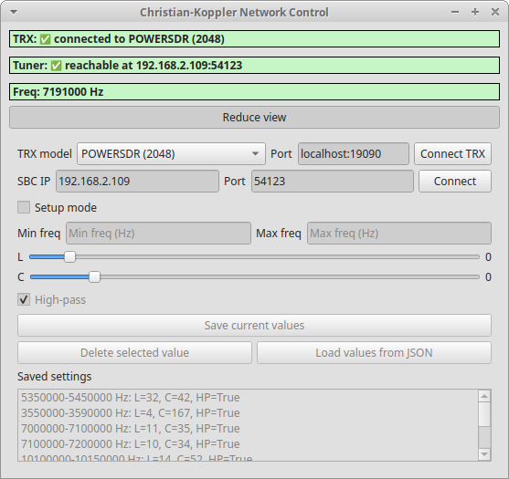

# Christian-Koppler Control Software



## Project Overview

The Christian-Koppler Control Software is a desktop application for controlling a Christian-Koppler (antenna tuner) over a LAN interface in conjunction with a transceiver (TRX) using CAT commands.  
The TRX control is handled via **[Hamlib](https://github.com/Hamlib/Hamlib)**, allowing seamless integration with a wide range of transceivers.


The software allows **automatic tuning** according to the frequency currently received by the TRX, as well as **manual setting and saving of L, C, and high/low-pass values** for specific frequency ranges.

The hardware interface to the tuner uses the **[SBC65EC](https://modtronix.com/product/sbc65ec/)** module from Modtronix.

The goal is to provide both **manual fine-tuning** and **automatic operation in live mode** in a convenient way.

> **Note:** The software is currently **tested and functional only on Linux**, as Hamlib has not yet been successfully compiled on Windows.

## Origin of the Concept

The basic concept for controlling the Christian-Koppler over a LAN interface with the **SBC65EC** module was developed by the **DARC e.V. local chapter Leichlingen-Langenfeld (R25)** and published by its members ([R25 PC-controlled Christian-Tuner Interface](http://r25.de/index.php/r25-pc-gesteuertes-christian-tuner-interface)).

The software presented here, **„ck-netctrl“**, is an independent Python implementation following the R25 concept only in terms of system design and hardware interface. It is written from scratch and follows the spirit of open-source as ham radio should be.

---

## SBC65EC Initial Setup

Before using the SBC65EC module to control the Christian-Koppler automatically via PC, the module must be configured. The following instructions guide through the **initial network and port configuration**.  

### Overview

The Tuner Interface receives the required control signals from the PC via LAN. It consists of a pre-assembled **SBC65EC** module from [Modtronix](https://modtronix.com/product/sbc65ec/) with a daughterboard that hosts **ULN2003 relay driver chips**, which switch the L, C and High/Lowpass relays in the Christian Tuner box.  

- The SBC65EC acts as a network device with its **own IP address**.  
- **Factory default IP:** `10.1.0.1`  
- You need to adjust the IP to match your PC network for proper communication.  

### Hardware Setup

- The SBC65EC module has **two 20-pin headers** on top.  
- A [daughterboard](https://github.com/dl3hc/ck-netctrl-hw) with **ULN2003 relay driver chips** is mounted via these headers.  
- Relay outputs are constantly supplied with 13.8 V and are switched to 0 V by the driver chips.  
- A 25-wire cable connects the outputs to the Christian-Koppler box.  
- This module replaces the original Tuner control panel.


### Network Configuration

1. Connect the SBC65EC to the PC via a **direct LAN cable (1:1)** for initial setup.  
   - If a router or switch is used, a **crossover cable** may be needed depending on the device.  
2. Access the module via a **web browser** (Internet Explorer, Firefox) using the **default IP `10.1.0.1`**.  
3. Log in with the **username and password** provided by the module documentation.  
4. Navigate to **System Configuration → Network Settings**.  
5. Adjust **IP address, subnet mask, and gateway** according to your PC/network.  
6. Click **Update** to save changes.  
7. **Power-cycle the module** for settings to take effect.  
8. Verify connectivity with a `ping` command from the PC.

### Port Configuration

- All ports must be set as **outputs** to drive the relays.  
- For standard operation, set the following ports as output:  
  - `A0-A5`, `B0-B5`, `C0-C2`, `C5`, `F0-F4`  
- Click **Submit** to save the port settings.

---

## "ck-netctrl" - Quick Start Guide 

### Requirements
- Python 3.10+  
- PyQt6
- [Hamlib](https://github.com/Hamlib/Hamlib) (tested on Linux only)

### Clone the Repository
```bash
git clone https://github.com/dl3hc/ck-netctrl.git
cd ck-netctrl
````

### Virtual Environment

```bash
python3 -m venv venv
source venv/bin/activate  # Linux/macOS
venv\Scripts\activate     # Windows (not tested)
```

### Install Python Dependencies

```bash
pip install --upgrade pip
pip install PyQt6
```

---

### Install / Compile Hamlib

* TRX communication is handled via Hamlib.
* Linux: Compile Hamlib with Python bindings enabled.
* Windows: Currently not possible.

Steps for Linux:

#### Install System Dependencies

```bash
sudo apt update
sudo apt install git build-essential autoconf automake libtool pkg-config libusb-1.0-0-dev libhamlib-dev swig python3-dev
```

**Explanation:**

* `libhamlib-dev` → Hamlib headers and library
* `swig` → generates Python bindings from C code
* `python3-dev` → Python development headers

---

#### Download Hamlib Source

```bash
git clone https://github.com/Hamlib/Hamlib
cd Hamlib
```

If cloned directly from Git, initialize the build system:

```bash
./bootstrap
```

> Skip this step for source releases.

#### Activate your virtual environment:

```bash
source .venv/bin/activate
which python3   # should point to VIRTUAL_ENV/bin/python3
```

#### Configure Hamlib (Out-of-Tree Build)

```bash
mkdir ../hamlib-build
cd ../hamlib-build
../Hamlib/configure --with-python-binding PYTHON="$VIRTUAL_ENV/bin/python3" --prefix="$VIRTUAL_ENV"
```

> `PYTHON=$(which python3)` uses the current Python version.
> `--prefix=$VIRTUAL_ENV` installs everything in the active venv (no root needed).

#### Build & Install

```bash
make -j$(nproc)
make install
```

Then go to the `bindings` folder:

```bash
cd ../Hamlib/bindings
make
make install
```

After this, your virtual environment should contain:

```
$VIRTUAL_ENV/lib/python3.12/site-packages/Hamlib.py
$VIRTUAL_ENV/lib/python3.12/site-packages/_Hamlib.so
```

#### Test the Installation

```bash
(.venv)python3 -c "import Hamlib; print(Hamlib)"
```

No errors indicate the Python bindings are correctly installed.

---

### Launch the Application

```bash
(.venv)python3 main.py
```

* Enter TRX and SBC IP/Port directly in the GUI.
* Enable setup mode → input values → save.
* Disable setup mode → values are automatically applied.

---

## Main Features

1. **TRX Status**

   * Displays whether a connection to the TRX exists.
   * Reads the current frequency.

2. **Tuner Status**

   * Displays whether the tuner is reachable over LAN.
   * Allows setting L, C, and high/low-pass values via sliders and checkbox.

3. **Setup Mode**

   * Enables **manual setting and saving** of values for defined frequency ranges.
   * Activates input fields for min/max frequency and sliders/checkboxes.
   * Disables automatic updates in live mode.

4. **Live Mode**

   * Automatically applies saved values based on the frequency currently read from the TRX.
   * Sliders and checkboxes are blocked to prevent accidental changes.

5. **Frequency Ranges / Settings**

   * Stores lower/upper frequency, L, C, and high/low-pass values.
   * Automatically loads values if the frequency falls within a saved range.
   * Displays a list of saved entries, highlighting the currently active one.
   * Saves TRX port/host and SBC IP/Port settings.

6. **Reduced / Advanced View**

   * Reduced view: Shows only TRX status, tuner status, and current frequency.
   * Advanced view: Includes sliders, checkbox, frequency input fields, and saved settings.

7. **Live Visualization**

   * Highlights active frequency range entries.
   * Shows active mode (Setup / Live) using visual indicators.

---

## Software Architecture / Modularity

The software is **modular**, allowing future extensions:

### Backend

* `trx.py`: Interface to the transceiver (via Hamlib).
* `messages.py`: Builds messages for L, C, and HP values.
* `settings.py`: Manages frequency ranges, L, C, HP values, and TRX/SBC settings.
* `utils/`

  * `network.py`: Ping, send\_udp
  * `sbc65ec.py`: SBC65-specific logic

### Frontend (GUI)

* `gui.py`: Main application window using PyQt6.

  * Status indicators (TRX, tuner, frequency)
  * L/C sliders, HP checkbox
  * Frequency range input fields
  * List of saved settings
  * Setup / Live mode
  * Reduced / Advanced view

---

## Project Structure

```
cknetctrl/
├─ gui.py
├─ main.py
├─ backend/
│  ├─ messages.py
│  ├─ trx.py
│  ├─ settings.py
│  └─ utils/
│     ├─ network.py
│     └─ sbc65ec.py
├─ docs/
│  ├─ L_C_Matrix.ods    
│  └─ SBC65EC_PinMatrix.txt
```

---

# Classes and Functions

| Module                     | Class / Function                                                      | Description / Purpose                                                                                                         |
| -------------------------- | --------------------------------------------------------------------- | ----------------------------------------------------------------------------------------------------------------------------- |
| `main.py`                  | `QApplication`                                                        | Starts the Qt application.                                                                                                    |
|                            | `MainWindow`                                                          | Initializes the main window of the Christian-Koppler software.                                                                |
|                            | `app.exec()`                                                          | Starts the Qt event loop.                                                                                                     |
| `gui.py`                   | `HeartbeatThread`                                                     | Thread for periodically checking tuner reachability.                                                                          |
|                            | `__init__(tuner, interval=1.0)`                                       | Initializes the heartbeat thread with tuner reference and interval.                                                           |
|                            | `run()`                                                               | Main thread loop; checks reachability and emits signals.                                                                      |
|                            | `stop()`                                                              | Safely stops the thread.                                                                                                      |
| `gui.py`                   | `MainWindow`                                                          | Main application window with GUI elements, status indicators, and backend logic.                                              |
|                            | `__init__()`                                                          | Initializes GUI, backend, timers, heartbeat thread, and signal connections.                                                   |
|                            | `connect_trx()`                                                       | Establishes TRX connection, updates status and timer.                                                                         |
|                            | `check_trx_connection()`                                              | Periodically checks TRX connection and updates status.                                                                        |
|                            | `update_status()`                                                     | Updates TRX status, frequency display, and loads values in live mode.                                                         |
|                            | `update_tuner_status(reachable)`                                      | Updates GUI tuner status based on reachability.                                                                               |
|                            | `toggle_setup_mode(checked)`                                          | Enables/disables setup mode and adjusts GUI accordingly.                                                                      |
|                            | `_apply_mode_settings()`                                              | Activates or deactivates widgets depending on the current mode.                                                               |
|                            | `toggle_view()`                                                       | Switches between reduced and advanced view.                                                                                   |
|                            | `schedule_update()`                                                   | Debounced update of tuner values on slider/checkbox changes.                                                                  |
|                            | `_send_tuner_values()`                                                | Sends current L, C, and HP values to the tuner.                                                                               |
|                            | `save_current()`                                                      | Saves current frequency range and TRX/SBC settings.                                                                           |
|                            | `delete_selected()`                                                   | Deletes the currently selected frequency entry.                                                                               |
|                            | `load_from_json()`                                                    | Loads frequency and tuner settings from a JSON file.                                                                          |
|                            | `load_list()`                                                         | Loads the GUI list of saved frequency ranges.                                                                                 |
|                            | `connect_to_sbc()`                                                    | Connects to the SBC65EC, checks reachability, and starts the heartbeat thread.                                                |
|                            | `load_saved_meta()`                                                   | Loads saved SBC and TRX settings into the GUI.                                                                                |
| `backend/trx.py`           | `TRX`                                                                 | Interface to the transceiver via Hamlib or dummy mode.                                                                        |
|                            | `__init__(rig_id, port, baudrate, databits, parity, stopbits, dummy)` | Initializes TRX object; selects Hamlib rig or dummy mode.                                                                     |
|                            | `list_available_rigs()`                                               | Returns a list of all known Hamlib rigs.                                                                                      |
|                            | `connect()`                                                           | Opens connection to the TRX or dummy.                                                                                         |
|                            | `get_frequency()`                                                     | Reads the current frequency from the TRX or dummy.                                                                            |
|                            | `close()`                                                             | Closes the connection to the TRX.                                                                                             |
| `backend/settings.py`      | `Settings`                                                            | Manages frequency ranges, TRX, and SBC settings.                                                                              |
|                            | `__init__(filename="settings.json")`                                  | Initializes settings and loads saved values.                                                                                  |
|                            | `load()`                                                              | Loads settings from the JSON file.                                                                                            |
|                            | `load_from_json(filename=None)`                                       | Loads settings from an optional JSON file.                                                                                    |
|                            | `save()`                                                              | Saves current frequency and TRX/SBC settings to JSON.                                                                         |
|                            | `get_for_frequency(freq)`                                             | Returns the saved entry for a given frequency.                                                                                |
|                            | `add_entry(min_freq, max_freq, L, C, highpass)`                       | Adds a new frequency range with L/C/HP values.                                                                                |
| `backend/messages.py`      | `build_messages(val_l, val_c, highpass)`                              | Builds all messages for the SBC65EC based on L, C, and HP values. Returns four byte arrays: msg\_a, msg\_b, msg\_c1, msg\_c2. |
| `backend/utils/sbc65ec.py` | `SBC65EC`                                                             | Controls the SBC65EC tuner via UDP; checks reachability and sends L, C, and HP values.                                        |
|                            | `__init__(host, port, debug)`                                         | Initializes the tuner with IP, port, and optional debug mode.                                                                 |
|                            | `check_reachability(timeout)`                                         | Checks if the tuner is reachable (via ICMP) and sets `reachable`.                                                             |
|                            | `send_values(l_value, c_value, highpass)`                             | Sends values to the tuner only if changed; optional debug output.                                                             |
| `backend/utils/network.py` | `ping_icmp(ip, timeout=1.0, attempts=3)`                              | Performs a standard ICMP ping; supports Windows and Linux.                                                                    |
|                            | `send_udp(ip, port, data, timeout=1.0)`                               | Sends a UDP packet to the given IP/port and returns True on success.                                                          |

---

## License

This project is **Open Source**, licensed under **GPLv3 + Non-Commercial**.

* **Non-Commercial:** The software may not be used for commercial purposes, including sale, licensing, or paid services.
* **Copyleft:** Any modifications or derivative works must also be published under the same license.
* **Disclaimer:** The software is provided without any warranty.

See the [LICENSE file](./LICENSE) in the repository for full license terms.


